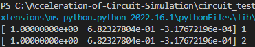

# Developer's Logging for project's Daybook

## 21/9/2022

Today, I have learned and researched a few KLU libraries that would be useful to be used for the overall project. I have also asked my supervisor if the KLU libraries that
were discovered would be a good resource for the project.

## 22/9/2022

Some resources from [learncpp](https://www.learncpp.com/) was studied more thoroughly to improve my understandings on the latest C++ 20. Currently, I was trying to understand more how scope, duration and linkages work in the C++20 syntax. One important thing that was gained is that the nesting's maximum level should always be 3 for compound statements.

## 23/9/2022

I continued learning more on [learncpp](https://www.learncpp.com/) for declarations and inline functions. The _consteval_ specifier can only be used if the function mostly runs on compile-time for performance, however it cannot be evaluated at runtime. For today, some changes on the Gantt Chart was made as the transient simulation was not achieved.

## 26/9/2022

My supervisor had advised to use the Armadillo library as a start for the project. I have started to test out the Armadillo library in VScode for C++. I have ran the code from [solarianprogrammer.com](https://solarianprogrammer.com/2017/03/24/getting-started-armadillo-cpp-linear-algebra-windows-mac-linux/) to test out the Armadillo library. The results are shown below:

The code ran perfectly with the 4x4 A matrix being generated by some random numbers and then being transposed. Then, the rows 1 and 3 are added while filling the 4th column with zeros. The B matrix is just the diagonal upmost left towards right of the A matrix while the other elements are filled with zero. This is called the diagonal matrix of A.

Tomorrow, I am planning to understand [arma sourceforge documents](http://arma.sourceforge.net/docs.html#example_prog) more while translating some LU decomposition and Newton Raphson iterations from MATLAB to C++.

## 27/9/2022

I have managed to create a code that test the LU decomposition and "solve' function from Armadillo library to solve x in Ax = b matrix equation.
The code runs well and could differentiate the lower and upper triangle of the matrix A. However, LU decomposition could not yet be used to solve the matrix equation. The results of the code is shown below:

## 28/9/2022

A new method of solving the matrix equation using LU decomposition can now be used. This involves the usage of the "solve" function.

## 30/9/2022

Currently, the priority has been shifted back into developing a transient simulation using MATLAB rather than learning how to create one in C++.
I have found a method in creating transient simulation using Newton Raphson, Backward-Euler integration, and LU decomposition in MATLAB.

I am trying to create a newton Raphson algorithm in MATLAB that uses the Jacobian matrix method. The method worked and matrix functions could be solved. I am planning to integrate the newton Raphson Jacobian solver with the Euler backward method for transient simulation.

## 5/10/2022

The integration between Newton Raphson using Jacobian matrix solver has been finished and could be run properly. The results from the transient simulation were compared between the two languages which were MATLAB and Python. 

THe code simulates an RLC circuit with the variables being, R is 1 ohm, L is 1.5H, and C being 0.0001F of a total 0.5s with n = 500 iterations and h = 0.001s time steps. The MATLAB code uses both backward and forward Euler integration while solving the values for capacitor voltage and current voltage. After simulating, the forward and backward Euler for the current values over time can be seen to be: 

There is a noticeable difference between the two methods due to the time step being quite huge. This is due to the nature of the assumption of Euler's backward and forward integration which has an error of O(n^2). In order to have a more accurate result, the time steps will be smaller while the number of iterations is increased. This is by setting h = 0.0001 and N = 50000. The results are shown below:

Simulation in python for the correct transient analysis will be done next.

## 6/10/2022 

A python code has been made by solving both the function and jacobian matrices using matmul function from the numpy library. By using the same RLC circuit variables and arrangements, the results of the code simulation could be seen to be:

The red line shows the current of the capacitor while the blue line shows the voltage of the capacitor. For a more detailed analysis of the current, this can be done by zooming in which shows:

It can be seen that it is similar to the MATLAB results which means that the Newton-Raphson using Jacobian matrix solver is accurate. However, it took the python program to run longer than the MATLAB program. Some changes will be done in the Transient_Test.py code, could be due to the log.message and print statement for the solved values. The time module from [pynative](https://pynative.com/python-get-execution-time-of-program/) will be used to analyse the amount of time taken for the code to execute the simulation.

The total execution time of the code with log.message is 165.326205 seconds. However, without the log.message and print statements in the loop, the total execution time of the code is only 14.2928447 seconds. This proves that my theory is correct and the log.message with print statements will be commented out for performance purposes.

To confirm this analysis is correct, a transient simulation using LTSpice and ngspice will be done.

## 7/10/2022

My supervisor had checked my code and commented that it should be more generic as bigger and more complex circuits will be analysed. A suggestion is that V_pulse for the voltage source should be added for the transient analysis code since currently it only simulates the steady state analysis. The code should also contain matrices as input for the project compared to using normal function variables.

## 10/10/2022

Today, I am trying to make a pseudocode that could relate both the code that I have made which uses transient simulation with the modified nodal analysis using LU decomposition. As found from this [lecture](https://pages.mtu.edu/~zhuofeng/EE5780Fall2013_files/Lecture_07_SpiceSimulation.pdf), the component values should start with MNA stamps as a good foundation in creating the circuit matrix. From this, the code should be changed from using hard-coded nodal equations into using MNA matrices derived from the nodal equations and MNA stamps.

The target size for the circuit simulation should consist of 5x5 matrix for the simple circuit.

## 11/10/2022

A generic code for a simple 5x5 matrix linear circuit has been made! The MNA stamps for resistor and current sources has been added and was successfully analysed with a simple circuit. The  circuit that was used was from the lecture [ECSE 597 Circuit Simulation and Modelling](https://www.youtube.com/watch?v=Eh3KzhcnpWw&list=PLlsTHbFeR7v0QG8Q4l6oc7d---eKKSKTz&index=2) that explains about MNA stamps. 

The python code has been added into the repository for supervisor's comment and further improvement in making it even more generic and efficient. The results of the linear circuit analysis from the python code is the same with the LTSpice OP analysis. The comparison between the two is shown below:

Python:

LTspice:

The orderings are seem to be different due to different naming convention on the LTspice models but the results are the same nonetheless. Tomorrow, I will simulate 2 more linear circuit from this code and then move on towards non-linear circuits. I will also try to add more components to be simulated for (eg. capacitor, voltage source, inductor)

## 12/10/2022

A comparison between the speed of my own plu_solver function with numpy's linalg.solve function has been made. The comparison was made using python's time library. Both seems to have a similar speed by which the linalg.solve is around 0.001-0.003 seconds while my plu_solver function is around 0.001-0.003 too.

The effort in making the code more generic is currently focused on how to ensure that the size of the matrix is not hardcoded. An improvement has been made as the size of the matrix could be seen to be depending on the total number of nodes and voltage sources. Thus, the size of the matrix is now depending on that rather than being hardcoded. This makes the circuit simulator a step closer as its ancestor, ngspice.

The code can now simulate any linear resistive networks with voltage sources, resistors and current sources. I have added a few functions which could manage the matrices properly. The tests of accuracy for the code was made using LTSpice and the results are shown below:

Python: 

LTSpice:

The values before this run were all negative with the same magnitude, which was a bit weird. I later found that my code actually has opposite direction of the nodes which I then changed and received the 100% accuracy of the simulation. The next step is to add non-linear components and variables, maybe a diode and see how it will serve. An idea of expansion is trying to get the user input which will drastically become more similar to a SPICE simulator.

## 13/10/2022

The 4th week meeting with supervisor was done. Dr Danial gave really good insights in future prospects and suggestions on improving the recent circuit matrices code. One of the suggestions is to add in the dynamic elements first rather than adding non-linear components as that will be the key for the transient simulation. If that is finished, the future prospect of the python script is then to add non-linear components and VCCS or ICCS sources. These will then open the window on making a random circuit generator with the goal of randomizing a 20 by 20 circuit matrix. 

## 17/10/2022

The goal for today is to add in dynamic elements inside the circuit such as capacitors and inductors. At the same time, pulse voltage source will also be added since it varies with time (time-variant sources). The variables will be analysed using Newton-Raphson solver for the iterations. In the Newton-Raphson solver, the Jacobian matrix will be used to test the matrices. As for now, the voltage source and current source that will added are the independent ones. 

## 18/10/2022

The dynamic elements were a bit hard to be added due to the Newton-Raphson Jacobian matrix solver is still using hard-coded functions. I have found a method of making the Jacobian matrix more generic and less hard-coded. The Jacobian matrix is actually just another set of conductance or dynamic element matrix, so this can be applied using MNA to get the Jacobian matrix. Since most of the methods of using Jacobian matrices are dependent on the functions of the nodal analysis, I can use MNA to derive the "hard-coded" functions by expanding the MNA to get the nodal analysis equations.  

From NewtonNonlinear.py code, I have changed the F_value from using the hard-coded F(x) function into using the expansion of J(x) with x values substracted by the RHS of the MNA equation. This makes the iteration a bit longer, but the code can now be more generic compared to before. The comparison of solutions using hard-coded function and the more generic method can be seen below.

Hard-coded:

Generic:

A tolerance of 1e-9 was chosen as that gives the least iteration for the most accurate value for both the hard-coded and generic methods. This analysis is based from the circuit below which contain a non-linear capacitor, a non-linear resistor, and a voltage source. The circuit is shown below:

This circuit analysis is based on this research paper which studies regarding MNA, Newton Raphson and Transient simulations, from [Opal, A. (2007) Computer-Aided Design, The Electrical Engineering Handbook. Academic Press.](https://www.sciencedirect.com/science/article/pii/B9780121709600500062)

## 19/10/2022

I have noticed that the expansion of the Jacobian matrix actually needs integration of the variables that we are trying to solve since it was from a derivative of the nodal analysis. This means that the expansion method that was used in NewtonNonlinear.py is not actually accurate even though it can solve for the iteration values. A thorough research on Jacobian matrix, conductance matrix and the nodal analysis function will be done again.

## 21/10/2022

I have managed to utilize the Jacobian matrix and Newton-Raphson iterative method for the non-linear part of the circuit. The circuit that was analysed is the Wheatstone bridge circuit. The arrangement of the circuit in LTSpice can be seen below:

The same circuit with same component values are then simulated in my code by performing the same DC OP analysis. Here, the non-linear analysis using Newton-Raphson was quite convoluted but I have managed to make it work. Since the code must be generic and not hard-coded, the way of doing this is by using the RHS and LHS matrices from before and adding the new diode stamp similar to how the other component stamps were added. However, the catch is that the MNA stamp addition section is also present in the Newton-Raphson algorithm. Most of these algorithms are derived from the [5th Lecture of Circuit analysis and Optimization](https://fides.fe.uni-lj.si/~zigar/CAO/lectures.php). 

Since the Newton-Raphson algorithm is derived from the equation below:

I have changed the way the solution's next iteration will be added which is similar to this equation. The linalg.solve function is used to solve the x in Ax=b since it also uses LU decomposition as intended evaluating sparse matrices. The RHS of the matrix is also added to the F_x matrix that follows the equation below:

The LHS matrix uses the diode stamp which have the following equation:

By constantly updating the values of the voltages inside the matrix by adding LHS and RHS with their respective new matrices, the Newton-Raphson can then converge on a solution that is accurate. The tolerance in this was chosen to be 1e-9 for high accuracy. The comparison results between the simple_linear.py code and LTSpice wheatstone bridge simulation can be seen below:

simple_linear.py:

LTSpice:

It can be seen that the values are really close to each other with only 0.3% to 0.6% error margin that makes it quite accurate. Now, the project focus can be shifted towards using the Newton-Raphson iteration algorithm to solve the dynamic elements to enable transient simulations.

# 24/10/2022

To start the dynamic elements, there are three parts that will need to be covered. First is adding the pulse voltage source, second is adding the inductor stamp for RHS and LHS matrices, and lastly, adding the capacitor stamp. The equation of the pulse voltage source can be seen in the Tuma-Buermen Circuit Simulation book, which shows:

Which t_d is the time delay, f is the frequency, t is the time, Vo is the voltage offset and Va is the voltage amplitude. From this, a for loop and if else statements could be used to create the time response of the sine wave pulse voltage. The values are chosen to be the same as shown in the Tuma-Buermen Circuit Simulation book which are Vo = 1V, Va = 0.5V, f = 1kHz, td = 1ms, and theta = 400 s^-1. The graph of this simulation from the code is seen below:

Which when compared with the simulation from the textbook is the same:

From this, the new sine wave Vsource can be added to test the transient response of the capacitor and inductors in the RLC circuit. This will be done tomorrow by adding the capacitor and inductor stamps. Hopefully, the transient response can then be tested out from the python code.

## 26/10/2022

Dr. Danial gave further improving comments regarding my coding style and naming conventions for the variables. Some of the variables' names have been changed as to be more in tune with the mathematical and circuit theories. One of the more noticeable changes were made for the naming of the node1 and node2 which is actually the x-th node and y-th node of the circuit. I have then changed the names to nodex and nodey as it fits more which also reduces some confusion regarding this.

Since non-linear diodes can now be simulated for DC OP analysis, the focus should now be on trying to make the transient work. The sine wave source can already be simulated but a voltage pulse would be an even better way of simulating as it solves more circuit problems compared to the sine wave. I am now going to understand the pulse voltage even further for it to be coded and simulated using Python.

## 29/10/2022

I have already succeeded in simulating a pulse voltage for the circuit. This is by using the mathematical equation of the waveform which is described to be,

From here, I have translated these formulas into code that uses if else for the condition of the time while having the user to input all the variables for the code. I have successfully generated a voltage pulse that follows the book which is shown below. I have used Vinitial = 0V, Von = 1, Time delay = 1e-3s, Rise time = 0.5e-3s, Fall time = 0.2e-3s, On time = 2e-3s, and Time period = 4e-3 s for the variables. The stop time is 6e-3s.

Voltage pulse from Python

Voltage pulse from the textbook

As seen from the voltage pulse, both are the same with each other as the input variables for the pulse voltage are the same. I stumbled accross an error when trying to make the pulse voltage which the loop stops as soon as it reaches the time period. This was then solved by setting the time in the voltage code to be the initial time so that it loops again. By doing this, I used -td as the initial time since it will loop back to the original time where the loop begins again. Following my for loop for the transient, the loop would stop at the end of the time set by the user. This will then plot the graph that takes in the nodal voltages or current that the user wants to be shown. 

The next target is trying to add this pulsed voltage source into the usual MNA resistive network stamps that I have made.

## 31/10/2022

The pulse voltage source can now be added into the main code. This is by replacing the normal DC voltage source in the RHS with the pulsed voltage source that has been made in the tests.py code. I have used the same code while adding a few changes in the for loop which constantly updates the new value of the pulse voltage for the graph to plot the nodal voltages values when checking each one of them. 

I have chosen the circuit below to test if my code works with high accuracy for the transient response of resistive networks.

Gratefully, the execution of the code went exactly as I have planned and it can now simulate a transient response of resistive networks that contains a pulsed voltage source. However, the limitation of my coding style is that it can only add one pulse voltage source but adding more resistors and diode in the circuit would still be possible. I have made a comparison analysis of my simulation for the resistive network using LTSpice to see how accurate it is. I have used Vinitial = 0V, Von = 1, Time delay = 1e-3s, Rise time = 0.5e-3s, Fall time = 0.2e-3s, On time = 2e-3s, and Time period = 4e-3 s for the variables. The stop time is now 12e-3s for better analysis.

LTSpice transient resistive network simulation

Python transient resistive network simulation

From this, the analysis are both the same which means that I could expand my circuit into accepting capacitors and inductors to check their transient response using my Python code.

## 2/11/2022

There are two ways of adding the capacitors into the circuit matrix. One is by using the Backward Euler method and the other is by using trapezoidal integration. The backward euler method does not include the current of the capacitor while the trapezoidal integration does include the current of the capacitor. The MNA stamp for backward euler method is shown below,

While the MNA stamp and equation for the trapezoidal integration of the capacitor is shown below,

For simplicity sake, the focus is only on adding the reactive component of the capacitor in the circuit so only the normal backward euler method is used. This means that the LHS have similar stamp with the resistor stamp while the RHS of the capacitor is similar to the current's stamp. In terms of coding, the function R_assigner and Is_assigner could be used for the LHS and RHS matrix stamp of the capacitors respectively.

Since the backward euler method is a non-linear equation and uses the value of the previous capacitor voltage for the nodal voltages to be solved, this means that Newton-Raphson method will be used to solve and integrate the capacitor into the circuit matrix.

This is done by creating an RC circuit to see the RC response graph plotted by having the same conditions in the code and LTSpice. The circuit that is going to be studied is shown on the figure below.

A few simulations have been made and the graph seems to be almost the same but a bit different. The pulse voltage that is being used is the same as before with the resistor R1 being 1kΩ and the capacitor's value is changed depending on the simulation of the RC response. A comparison between the python code's simulation and LTSpice's simulation can be made on different capacitances.

Python code with C = 100e-6F

LTSpice simulation with C = 100e-6F

Python code with C = 100e-8F

LTSpice simulation with C = 100e-8F

Python code with C = 100e-10F

LTSpice simulation with C = 100e-10F

As it can be seen, the 2nd nodal voltage plot from the Python code is opposite compared to LTSPice on large capacitances but then have the same plot with smaller capacitances. I suspect that the lack of timestep control might be the fatal error in this simulations. From the [Circuit simulation with Spice Opus](https://books.google.co.uk/books?id=43RNRknMvlgC&amp;printsec=frontcover&amp;redir_esc=y#v=onepage&amp;q&amp;f=false) textbook, convergence error is normal when using Newton-Raphson to solve the matrices. So, a convergence control for the timestep have been added if the Newton-Raphson exceeds 5 loops, the timestep, h, will be divided by 10. However, this seems to still not solve the error so there might be something else that is wrong in the code. Further debugging will be done on the code to check if everything is working properly.

## 4/11/2022

I have noticed that in order to run a proper transient simulation, the OP analysis is an important factor to focus on rather than the timestep control. Surprisingly, my code did not properly establish the OP analysis as the initial condition for the transient simulation. After making some debuggings, I have then added the OP analysis of the linear resistive networks in the circuit matrices as the initial condition for my transient simulation. The simulation then ran properly as intended which is similar to the LTSPice transient simulation.

Upon achieving this successful results, I have decided to add make the code more modular to add in more capacitors in the Newton-Raphson solver. This had enable me to simulate bigger circuits as more components can now be added into the circuit matrices. The circuit used as the next test on the new code is shown below.

Dynamic RC circuit

I have also changed the Von and Voff to be 6V and 2V respectively just to ensure that changing the variables is foolproof. Gratefully, the code could run perfectly which shows the transient graph of nodal voltage 1, nodal voltage 2, nodal voltage 3 and the source voltage's current. The simulation plot is shown below.

Python code plot for the dynamic RC circuit

This plot is then compared to the LTSpice simulation to confirm that it is accurate and precise of an existing SPICE software. The LTSpice transient simulation is given below.

LTSpice plot for the dynamic RC circuit

From this, it can be confirmed that my code is working properly and the same format can be used to add more components into the code which would now enable the testings of accelerating more complex dynamic circuits. The code has also been cleaned up for better understanding on the different functions and variables for the transient simulation with comments explaining the different functionalities and executions.
