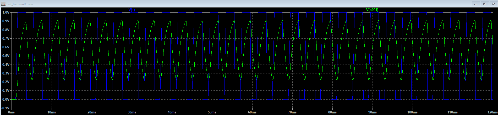
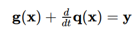
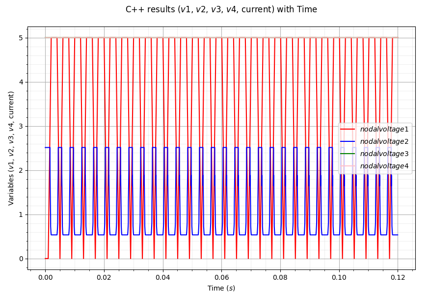
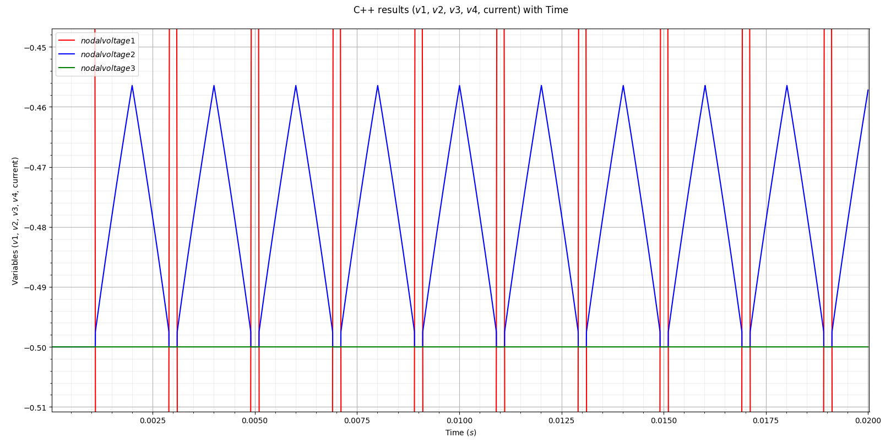
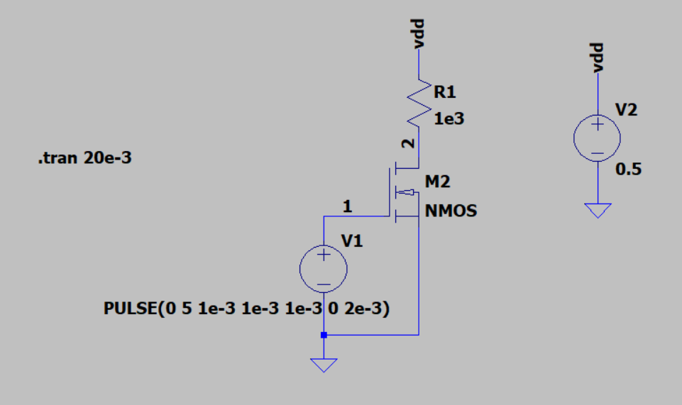
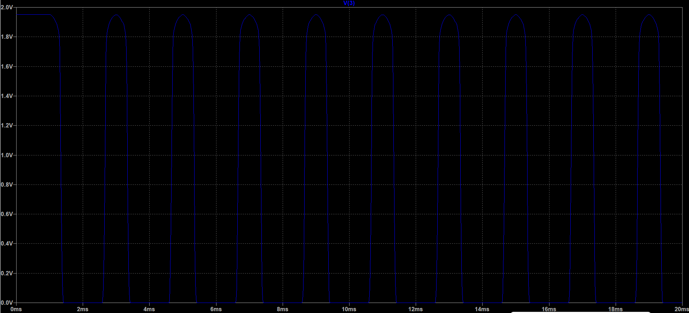
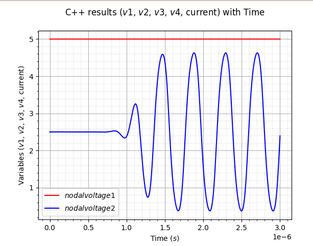
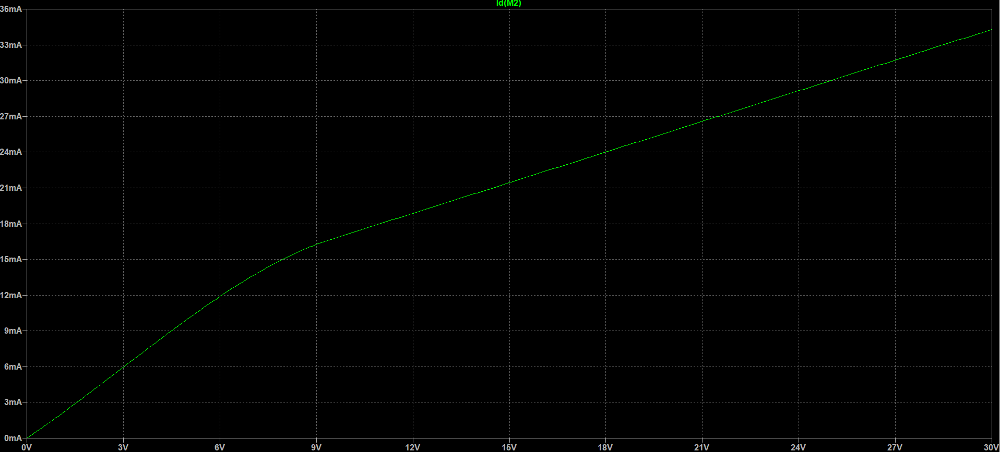
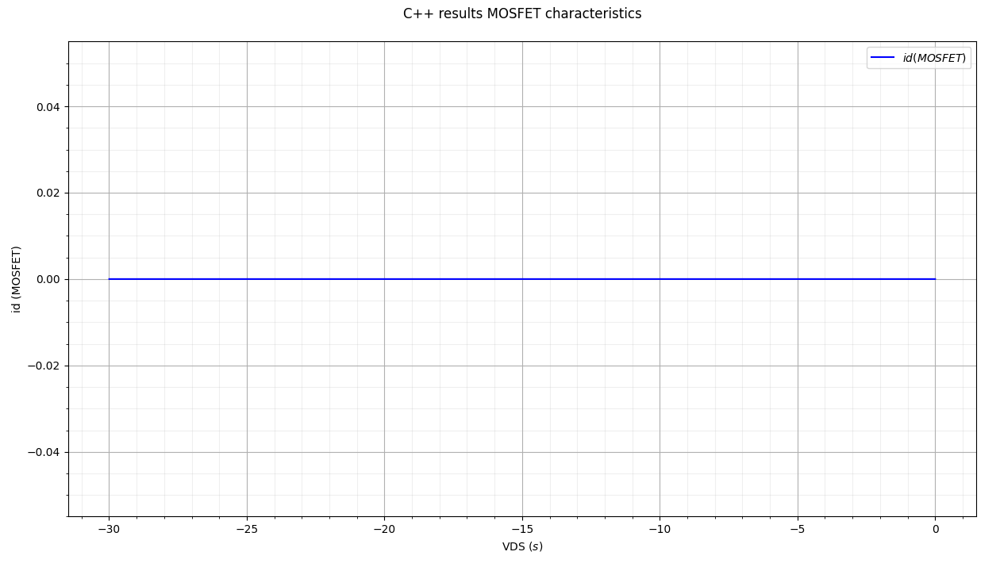

# Developer's Logging for project's Daybook

## 21/9/2022

Today, I have learned and researched a few KLU libraries that would be useful to be used for the overall project. I have also asked my supervisor if the KLU libraries that
were discovered would be a good resource for the project.

## 22/9/2022

Some resources from [learncpp](https://www.learncpp.com/) was studied more thoroughly to improve my understandings on the latest C++ 20. Currently, I was trying to understand more how scope, duration and linkages work in the C++20 syntax. One important thing that was gained is that the nesting's maximum level should always be 3 for compound statements.

## 23/9/2022

I continued learning more on [learncpp](https://www.learncpp.com/) for declarations and inline functions. The _consteval_ specifier can only be used if the function mostly runs on compile-time for performance, however it cannot be evaluated at runtime. For today, some changes on the Gantt Chart was made as the transient simulation was not achieved.

## 26/9/2022

My supervisor had advised to use the Armadillo library as a start for the project. I have started to test out the Armadillo library in VScode for C++. I have ran the code from [solarianprogrammer.com](https://solarianprogrammer.com/2017/03/24/getting-started-armadillo-cpp-linear-algebra-windows-mac-linux/) to test out the Armadillo library. The results are shown below:

The code ran perfectly with the 4x4 A matrix being generated by some random numbers and then being transposed. Then, the rows 1 and 3 are added while filling the 4th column with zeros. The B matrix is just the diagonal upmost left towards right of the A matrix while the other elements are filled with zero. This is called the diagonal matrix of A.

Tomorrow, I am planning to understand [arma sourceforge documents](http://arma.sourceforge.net/docs.html#example_prog) more while translating some LU decomposition and Newton Raphson iterations from MATLAB to C++.

## 27/9/2022

I have managed to create a code that test the LU decomposition and "solve' function from Armadillo library to solve x in Ax = b matrix equation.
The code runs well and could differentiate the lower and upper triangle of the matrix A. However, LU decomposition could not yet be used to solve the matrix equation. The results of the code is shown below:

## 28/9/2022

A new method of solving the matrix equation using LU decomposition can now be used. This involves the usage of the "solve" function.

## 30/9/2022

Currently, the priority has been shifted back into developing a transient simulation using MATLAB rather than learning how to create one in C++.
I have found a method in creating transient simulation using Newton Raphson, Backward-Euler integration, and LU decomposition in MATLAB.

I am trying to create a newton Raphson algorithm in MATLAB that uses the Jacobian matrix method. The method worked and matrix functions could be solved. I am planning to integrate the newton Raphson Jacobian solver with the Euler backward method for transient simulation.

## 5/10/2022

The integration between Newton Raphson using Jacobian matrix solver has been finished and could be run properly. The results from the transient simulation were compared between the two languages which were MATLAB and Python. 

THe code simulates an RLC circuit with the variables being, R is 1 ohm, L is 1.5H, and C being 0.0001F of a total 0.5s with n = 500 iterations and h = 0.001s time steps. The MATLAB code uses both backward and forward Euler integration while solving the values for capacitor voltage and current voltage. After simulating, the forward and backward Euler for the current values over time can be seen to be: 

There is a noticeable difference between the two methods due to the time step being quite huge. This is due to the nature of the assumption of Euler's backward and forward integration which has an error of O(n^2). In order to have a more accurate result, the time steps will be smaller while the number of iterations is increased. This is by setting h = 0.0001 and N = 50000. The results are shown below:

Simulation in python for the correct transient analysis will be done next.

## 6/10/2022 

A python code has been made by solving both the function and jacobian matrices using matmul function from the numpy library. By using the same RLC circuit variables and arrangements, the results of the code simulation could be seen to be:

The red line shows the current of the capacitor while the blue line shows the voltage of the capacitor. For a more detailed analysis of the current, this can be done by zooming in which shows:

It can be seen that it is similar to the MATLAB results which means that the Newton-Raphson using Jacobian matrix solver is accurate. However, it took the python program to run longer than the MATLAB program. Some changes will be done in the Transient_Test.py code, could be due to the log.message and print statement for the solved values. The time module from [pynative](https://pynative.com/python-get-execution-time-of-program/) will be used to analyse the amount of time taken for the code to execute the simulation.

The total execution time of the code with log.message is 165.326205 seconds. However, without the log.message and print statements in the loop, the total execution time of the code is only 14.2928447 seconds. This proves that my theory is correct and the log.message with print statements will be commented out for performance purposes.

To confirm this analysis is correct, a transient simulation using LTSpice and ngspice will be done.

## 7/10/2022

My supervisor had checked my code and commented that it should be more generic as bigger and more complex circuits will be analysed. A suggestion is that V_pulse for the voltage source should be added for the transient analysis code since currently it only simulates the steady state analysis. The code should also contain matrices as input for the project compared to using normal function variables.

## 10/10/2022

Today, I am trying to make a pseudocode that could relate both the code that I have made which uses transient simulation with the modified nodal analysis using LU decomposition. As found from this [lecture](https://pages.mtu.edu/~zhuofeng/EE5780Fall2013_files/Lecture_07_SpiceSimulation.pdf), the component values should start with MNA stamps as a good foundation in creating the circuit matrix. From this, the code should be changed from using hard-coded nodal equations into using MNA matrices derived from the nodal equations and MNA stamps.

The target size for the circuit simulation should consist of 5x5 matrix for the simple circuit.

## 11/10/2022

A generic code for a simple 5x5 matrix linear circuit has been made! The MNA stamps for resistor and current sources has been added and was successfully analysed with a simple circuit. The  circuit that was used was from the lecture [ECSE 597 Circuit Simulation and Modelling](https://www.youtube.com/watch?v=Eh3KzhcnpWw&list=PLlsTHbFeR7v0QG8Q4l6oc7d---eKKSKTz&index=2) that explains about MNA stamps. 

The python code has been added into the repository for supervisor's comment and further improvement in making it even more generic and efficient. The results of the linear circuit analysis from the python code is the same with the LTSpice OP analysis. The comparison between the two is shown below:

Python:

LTspice:

The orderings are seem to be different due to different naming convention on the LTspice models but the results are the same nonetheless. Tomorrow, I will simulate 2 more linear circuit from this code and then move on towards non-linear circuits. I will also try to add more components to be simulated for (eg. capacitor, voltage source, inductor)

## 12/10/2022

A comparison between the speed of my own plu_solver function with numpy's linalg.solve function has been made. The comparison was made using python's time library. Both seems to have a similar speed by which the linalg.solve is around 0.001-0.003 seconds while my plu_solver function is around 0.001-0.003 too.

The effort in making the code more generic is currently focused on how to ensure that the size of the matrix is not hardcoded. An improvement has been made as the size of the matrix could be seen to be depending on the total number of nodes and voltage sources. Thus, the size of the matrix is now depending on that rather than being hardcoded. This makes the circuit simulator a step closer as its ancestor, ngspice.

The code can now simulate any linear resistive networks with voltage sources, resistors and current sources. I have added a few functions which could manage the matrices properly. The tests of accuracy for the code was made using LTSpice and the results are shown below:

Python: 

LTSpice:

The values before this run were all negative with the same magnitude, which was a bit weird. I later found that my code actually has opposite direction of the nodes which I then changed and received the 100% accuracy of the simulation. The next step is to add non-linear components and variables, maybe a diode and see how it will serve. An idea of expansion is trying to get the user input which will drastically become more similar to a SPICE simulator.

## 13/10/2022

The 4th week meeting with supervisor was done. Dr Danial gave really good insights in future prospects and suggestions on improving the recent circuit matrices code. One of the suggestions is to add in the dynamic elements first rather than adding non-linear components as that will be the key for the transient simulation. If that is finished, the future prospect of the python script is then to add non-linear components and VCCS or ICCS sources. These will then open the window on making a random circuit generator with the goal of randomizing a 20 by 20 circuit matrix. 

## 17/10/2022

The goal for today is to add in dynamic elements inside the circuit such as capacitors and inductors. At the same time, pulse voltage source will also be added since it varies with time (time-variant sources). The variables will be analysed using Newton-Raphson solver for the iterations. In the Newton-Raphson solver, the Jacobian matrix will be used to test the matrices. As for now, the voltage source and current source that will added are the independent ones. 

## 18/10/2022

The dynamic elements were a bit hard to be added due to the Newton-Raphson Jacobian matrix solver is still using hard-coded functions. I have found a method of making the Jacobian matrix more generic and less hard-coded. The Jacobian matrix is actually just another set of conductance or dynamic element matrix, so this can be applied using MNA to get the Jacobian matrix. Since most of the methods of using Jacobian matrices are dependent on the functions of the nodal analysis, I can use MNA to derive the "hard-coded" functions by expanding the MNA to get the nodal analysis equations.  

From NewtonNonlinear.py code, I have changed the F_value from using the hard-coded F(x) function into using the expansion of J(x) with x values substracted by the RHS of the MNA equation. This makes the iteration a bit longer, but the code can now be more generic compared to before. The comparison of solutions using hard-coded function and the more generic method can be seen below.

Hard-coded:

Generic:

A tolerance of 1e-9 was chosen as that gives the least iteration for the most accurate value for both the hard-coded and generic methods. This analysis is based from the circuit below which contain a non-linear capacitor, a non-linear resistor, and a voltage source. The circuit is shown below:

This circuit analysis is based on this research paper which studies regarding MNA, Newton Raphson and Transient simulations, from [Opal, A. (2007) Computer-Aided Design, The Electrical Engineering Handbook. Academic Press.](https://www.sciencedirect.com/science/article/pii/B9780121709600500062)

## 19/10/2022

I have noticed that the expansion of the Jacobian matrix actually needs integration of the variables that we are trying to solve since it was from a derivative of the nodal analysis. This means that the expansion method that was used in NewtonNonlinear.py is not actually accurate even though it can solve for the iteration values. A thorough research on Jacobian matrix, conductance matrix and the nodal analysis function will be done again.

## 21/10/2022

I have managed to utilize the Jacobian matrix and Newton-Raphson iterative method for the non-linear part of the circuit. The circuit that was analysed is the Wheatstone bridge circuit. The arrangement of the circuit in LTSpice can be seen below:

The same circuit with same component values are then simulated in my code by performing the same DC OP analysis. Here, the non-linear analysis using Newton-Raphson was quite convoluted but I have managed to make it work. Since the code must be generic and not hard-coded, the way of doing this is by using the RHS and LHS matrices from before and adding the new diode stamp similar to how the other component stamps were added. However, the catch is that the MNA stamp addition section is also present in the Newton-Raphson algorithm. Most of these algorithms are derived from the [5th Lecture of Circuit analysis and Optimization](https://fides.fe.uni-lj.si/~zigar/CAO/lectures.php). 

Since the Newton-Raphson algorithm is derived from the equation below:

I have changed the way the solution's next iteration will be added which is similar to this equation. The linalg.solve function is used to solve the x in Ax=b since it also uses LU decomposition as intended evaluating sparse matrices. The RHS of the matrix is also added to the F_x matrix that follows the equation below:

The LHS matrix uses the diode stamp which have the following equation:

By constantly updating the values of the voltages inside the matrix by adding LHS and RHS with their respective new matrices, the Newton-Raphson can then converge on a solution that is accurate. The tolerance in this was chosen to be 1e-9 for high accuracy. The comparison results between the simple_linear.py code and LTSpice wheatstone bridge simulation can be seen below:

simple_linear.py:

LTSpice:

It can be seen that the values are really close to each other with only 0.3% to 0.6% error margin that makes it quite accurate. Now, the project focus can be shifted towards using the Newton-Raphson iteration algorithm to solve the dynamic elements to enable transient simulations.

# 24/10/2022

To start the dynamic elements, there are three parts that will need to be covered. First is adding the pulse voltage source, second is adding the inductor stamp for RHS and LHS matrices, and lastly, adding the capacitor stamp. The equation of the pulse voltage source can be seen in the Tuma-Buermen Circuit Simulation book, which shows:

Which t_d is the time delay, f is the frequency, t is the time, Vo is the voltage offset and Va is the voltage amplitude. From this, a for loop and if else statements could be used to create the time response of the sine wave pulse voltage. The values are chosen to be the same as shown in the Tuma-Buermen Circuit Simulation book which are Vo = 1V, Va = 0.5V, f = 1kHz, td = 1ms, and theta = 400 s^-1. The graph of this simulation from the code is seen below:

Which when compared with the simulation from the textbook is the same:

From this, the new sine wave Vsource can be added to test the transient response of the capacitor and inductors in the RLC circuit. This will be done tomorrow by adding the capacitor and inductor stamps. Hopefully, the transient response can then be tested out from the python code.

## 26/10/2022

Dr. Danial gave further improving comments regarding my coding style and naming conventions for the variables. Some of the variables' names have been changed as to be more in tune with the mathematical and circuit theories. One of the more noticeable changes were made for the naming of the node1 and node2 which is actually the x-th node and y-th node of the circuit. I have then changed the names to nodex and nodey as it fits more which also reduces some confusion regarding this.

Since non-linear diodes can now be simulated for DC OP analysis, the focus should now be on trying to make the transient work. The sine wave source can already be simulated but a voltage pulse would be an even better way of simulating as it solves more circuit problems compared to the sine wave. I am now going to understand the pulse voltage even further for it to be coded and simulated using Python.

## 29/10/2022

I have already succeeded in simulating a pulse voltage for the circuit. This is by using the mathematical equation of the waveform which is described to be,

From here, I have translated these formulas into code that uses if else for the condition of the time while having the user to input all the variables for the code. I have successfully generated a voltage pulse that follows the book which is shown below. I have used Vinitial = 0V, Von = 1, Time delay = 1e-3s, Rise time = 0.5e-3s, Fall time = 0.2e-3s, On time = 2e-3s, and Time period = 4e-3 s for the variables. The stop time is 6e-3s.

Voltage pulse from Python

Voltage pulse from the textbook

As seen from the voltage pulse, both are the same with each other as the input variables for the pulse voltage are the same. I stumbled accross an error when trying to make the pulse voltage which the loop stops as soon as it reaches the time period. This was then solved by setting the time in the voltage code to be the initial time so that it loops again. By doing this, I used -td as the initial time since it will loop back to the original time where the loop begins again. Following my for loop for the transient, the loop would stop at the end of the time set by the user. This will then plot the graph that takes in the nodal voltages or current that the user wants to be shown. 

The next target is trying to add this pulsed voltage source into the usual MNA resistive network stamps that I have made.

## 31/10/2022

The pulse voltage source can now be added into the main code. This is by replacing the normal DC voltage source in the RHS with the pulsed voltage source that has been made in the tests.py code. I have used the same code while adding a few changes in the for loop which constantly updates the new value of the pulse voltage for the graph to plot the nodal voltages values when checking each one of them. 

I have chosen the circuit below to test if my code works with high accuracy for the transient response of resistive networks.

Gratefully, the execution of the code went exactly as I have planned and it can now simulate a transient response of resistive networks that contains a pulsed voltage source. However, the limitation of my coding style is that it can only add one pulse voltage source but adding more resistors and diode in the circuit would still be possible. I have made a comparison analysis of my simulation for the resistive network using LTSpice to see how accurate it is. I have used Vinitial = 0V, Von = 1, Time delay = 1e-3s, Rise time = 0.5e-3s, Fall time = 0.2e-3s, On time = 2e-3s, and Time period = 4e-3 s for the variables. The stop time is now 12e-3s for better analysis.

LTSpice transient resistive network simulation

Python transient resistive network simulation

From this, the analysis are both the same which means that I could expand my circuit into accepting capacitors and inductors to check their transient response using my Python code.

## 2/11/2022

There are two ways of adding the capacitors into the circuit matrix. One is by using the Backward Euler method and the other is by using trapezoidal integration. The backward euler method does not include the current of the capacitor while the trapezoidal integration does include the current of the capacitor. The MNA stamp for backward euler method is shown below,

While the MNA stamp and equation for the trapezoidal integration of the capacitor is shown below,

For simplicity sake, the focus is only on adding the reactive component of the capacitor in the circuit so only the normal backward euler method is used. This means that the LHS have similar stamp with the resistor stamp while the RHS of the capacitor is similar to the current's stamp. In terms of coding, the function R_assigner and Is_assigner could be used for the LHS and RHS matrix stamp of the capacitors respectively.

Since the backward euler method is a non-linear equation and uses the value of the previous capacitor voltage for the nodal voltages to be solved, this means that Newton-Raphson method will be used to solve and integrate the capacitor into the circuit matrix.

This is done by creating an RC circuit to see the RC response graph plotted by having the same conditions in the code and LTSpice. The circuit that is going to be studied is shown on the figure below.

A few simulations have been made and the graph seems to be almost the same but a bit different. The pulse voltage that is being used is the same as before with the resistor R1 being 1kΩ and the capacitor's value is changed depending on the simulation of the RC response. A comparison between the python code's simulation and LTSpice's simulation can be made on different capacitances.

Python code with C = 100e-6F

LTSpice simulation with C = 100e-6F

Python code with C = 100e-8F

LTSpice simulation with C = 100e-8F

Python code with C = 100e-10F

LTSpice simulation with C = 100e-10F

As it can be seen, the 2nd nodal voltage plot from the Python code is opposite compared to LTSpice on large capacitances but then have the same plot with smaller capacitances. I suspect that the lack of timestep control might be the fatal error in this simulations. From the [Circuit simulation with Spice Opus](https://books.google.co.uk/books?id=43RNRknMvlgC&amp;printsec=frontcover&amp;redir_esc=y#v=onepage&amp;q&amp;f=false) textbook, convergence error is normal when using Newton-Raphson to solve the matrices. So, a convergence control for the timestep have been added if the Newton-Raphson exceeds 5 loops, the timestep, h, will be divided by 10. However, this seems to still not solve the error so there might be something else that is wrong in the code. Further debugging will be done on the code to check if everything is working properly.

## 4/11/2022

I have noticed that in order to run a proper transient simulation, the OP analysis is an important factor to focus on rather than the timestep control. Surprisingly, my code did not properly establish the OP analysis as the initial condition for the transient simulation. After making some debuggings, I have then added the OP analysis of the linear resistive networks in the circuit matrices as the initial condition for my transient simulation. The simulation then ran properly as intended which is similar to the LTSpice transient simulation.

Upon achieving this successful results, I have decided to add make the code more modular to add in more capacitors in the Newton-Raphson solver. This had enable me to simulate bigger circuits as more components can now be added into the circuit matrices. The circuit used as the next test on the new code is shown below.

Dynamic RC circuit

I have also changed the Von and Voff to be 6V and 2V respectively just to ensure that changing the variables is foolproof. Gratefully, the code could run perfectly which shows the transient graph of nodal voltage 1, nodal voltage 2, nodal voltage 3 and the source voltage's current. The simulation plot is shown below.

Python code plot for the dynamic RC circuit

This plot is then compared to the LTSpice simulation to confirm that it is accurate and precise of an existing SPICE software. The LTSpice transient simulation is given below.

LTSpice plot for the dynamic RC circuit

From this, it can be confirmed that my code is working properly and the same format can be used to add more components into the code which would now enable the testings of accelerating more complex dynamic circuits. The code has also been cleaned up for better understanding on the different functions and variables for the transient simulation with comments explaining the different functionalities and executions.

## 7/11/2022

Since the capacitor, resistor and voltage source can now be analysed properly using the code, I have decided to add in the diode matrix that I have done an OP analysis before into the transient simulation. In order to add the diode matrix, the overall equation for the transient simulation is a bit different compared to the equation from the OP analysis. The overall equation can be seen below.

Overall equation for the transient simulation

The g(x) and y are the nonlinear vector-valued function which represent the resistive part of the circuit and its excitations. However, q(x) is a vector-valued function that expresses the total charge stored by capacitors connected to a specific node in the circuit. In transient simulation, the diode also contains its capacitive part which will be added in the q(x) matrix. The capacitive part of the diode is denoted as cd in the code.

From the code, the diode matrix is assigned in both the OPanalysis_system and the NewtonRaphson_system functions since the diode is a non-linear component. To run the circuit simulation which contains the diode, the circuit below has been made in LTSpice as a reference.

Dynamic network containing a diode

The simulation is then run on both LTSpice and the Python code to compare if the written code is correct. Both simulations are shown below.

LTSpice dynamic network containing a diode simulation

Python code dynamic network containing a diode simulation

It can be seen that the shape of the graph for both are quite similar except for the starting position. Since v2 and v3 are the nodal voltages where the diode is located at, there is a bit of a convergence error during the starting time but then it converges to the correct value which is around 5.76V at 120ms. For the LTSpice simulation, it converges to a value of around 5.70V at 120ms which means that the convergence after some time is almost the same. 

This convergence error could be due to the unoptimized code that does not contain any timestep control or OP analysis control compared to the SPICE simulator software. This can be an extra goal for the project in perfecting the code if it is possible. The next step is to focus on expanding the circuit matrices and accelerating the sparse matrix using C++.

## 8/11/2022 

A meeting with my supervisor was held today and we had found a really good breakthrough on the code. We had debugged the code on why the diode could not perform correctly as the one in the LTSpice. The first method we tried was by adding another resistor in front of the diode with a really small resistance. In theory, it should not have any effect on the graph since the resistance is really small. This is to debug if the problem is due to the resistor stamp which affects the way the diode's response in the output signal of the circuit. The new circuit that was added can be seen below.

First debugging circuit for the diode

After running the simulation, it seems that there is no changes to the graph which means that the resistor stamp is not the problem in this code. From the previous diode simulation graph on the python code, it can be seen that only nodal voltages 2 and 3 are having the oscillation problem. Dr Danial commented that the oscillation could not have occurred at the first place since there are no inductors in the circuit to provide any oscillation. This could only mean that the problem is between nodal voltages 2 and 3 which is the diode. 

To debug this, the diode is isolated in a normal resistor and diode circuit which can be seen below.

Second debugging circuit for the diode

From this circuit it enables us to check if the diode model is the problem with the circuit. A suggestion from Dr Danial is to try simulating a normal diode making the current flowing in one way. The parameters for the input voltage is also changed from 2V and 6V to -1V and 1V as the off and on voltage respectively. This would enable us to see if the output signal would be flipped if the diode was flipped. The normal direction of the diode was first chosen from node 2 to node 0 which is opposite from the figure above. The graphs of the Python code and LTSpice simulation are then analysed and compared to see if they are the same. The graphs are shown below.

Python simulation

LTSpice simulation

The graphs of the code could be seen to be the same. So, it means that it works if the diode is facing on that particular direction. Now, the position of the diode is reversed to see if there are any change on the graphs. The diode is then changed from node 0 to node 2 which is the position that can be seen in the circuit figure above. The graphs of the Python code and LTSpice simulation are then analysed and compared to see if they are the same. The graphs are shown below.

Python simulation

LTSpice simulation

The graph of the code is now different compared to the LTSpice simulation. It can be seen that the convergence error now occurs when the diode is opposite. The only possible explanation is that there is an error when the diode is modelled inside the code. From the circuit theory, the diode is modelled after a resistor and a capacitor in parallel with the current, id, flowing across them. This is seen on the figure below.

Since the diode uses Shockley's diode equation for the linearized model, it can only mean that the problem is with the equation. I then noticed that sometimes the convergence could oscillate quite far if the signs of the variable is different. In this case, the sign of the equation is then changed to see if the problem is solved. A possible explanation for this is because the RHS takes in the value of the current, so the current is opposite when it is on the opposite direction, thus the negative sign is needed. The simulation is made again with the sign changed on the x1 variable in the Diode_assigner function that feeds in the RHS matrix. The simulation of the circuit from the graphs are shown below.

Python simulation

LTSpice simulation

It can be seen that the graphs are now the same but it contains a slight error when it starts because my code does not have any timestep control. This goes the same for the value when it is turned off or on depending on the diode's position. The value of the voltage seems to be a slightly different compared to the LTspice simulation. From the python code simulation, the nodal voltage 2 when it is turned off is around -0.5464V while the LTSpice simulation is around -0.5028V. This means that the error is calculated to be around 8% without any timestep control. It is still considered quite accurate with an accuracy percentage of 92% for the python code simulation. The circuit from the first debugging has been tested again to see if the diode is working properly inside the transient simulation of the python code. The results of the python code can be seen below.

Python code transient simulation

LTSpice transient simulation

It can now be seen that the python code simulation results is the same as the LTspice transient simulation. From this, transistor models can be added in the python code. Another new objective is also translating the python code into C++ code to evaluate the multi-core processor's performance improvements. 

## 9/11/2022

The C++ code has been added using the [armadillo library (documentation)](https://arma.sourceforge.net/docs.html#solve) by using the same methods and algorithm with the python code.. The aim is to finish the Voltage source, Current source, and Resistor stamp in the C++ code. As a start, the R_assigner and Is_assigner code has been created using the same method from the python. To do this in C++, the variable of the matrix is declared using arma::mat from the armadillo library. The a variable is then assigned to the specific row and column using .row() and .col() functions. By using .print() function from the armadillo library, the elements of the matrix can then be checked for debugging purposes.

After checking the elements inside the RHS and LHS matrix, it seems to be working properly. Now, to solve the x from the LHS and RHS matrices in Ax = b fashion where A is LHS and b is RHS, the solve() function from the armadillo library can be used. This uses the LU decomposition with optimized that is quite similar to the np.linalg.solve() function from python. This is tested by using a linear circuit which is also simulated in the LTSpice simulation as done before for the python code. The circuit that is used for this is shown below.

The results of this simulation on the C++ code and LTSpice can be seen below.

LTSpice simulation

C++ code simulation

From both the solution, the nodal voltages and current shown are the same for both the C++ and LTSpice results. I have also added another linear circuit to test if it is working with other circuit arrangements. This is tested with the circuit shown below.

which gives the analysis results of

LTSpice simulation

C++ code simulation

The x matrix can be seen to be solved using these methods. This solves for the linear part of the circuit with 100% accuracy. For the next goal, the diode with the Newton Raphson loop will be added to see if it is working for the non-linear circuit in the C++ code.

# 14/11/2022

The diode is added in the C++ code by using the Diode_assigner() function which takes in the modified nodal analysis stamp of the circuit. The Diode_assigner() function is called into the NewtonRaphson_system() function uses the same algorithm used from Tuma-Buermen Circuit Simulation book. This will make the loop to constantly add in the value of the LHS and RHS matrix which updates the solution matrix. This will then converge to reach the most accurate solution of the circuit matrices. As for a start, the maximum iteration chosen for this circuit is at 50 iterations to avoid any convergence error.

The circuit chosen to test the newly added diode and non-linearity in this code is the wheatstone bridge circuit but the diodes and resistors have the opposite position. This circuit is shown below.

The OP analysis of the circuit is then done by running on the C++ code and LTSpice simulator to see if the Newton Raphson algorithm and diode matrix stamp is working properly. The OP analysis results are shown below.

LTSpice circuit analysis

C++ code analysis

The results are seen to have 97.538% accuracy for the OP analysis on the C++ code. The 2% error in the code could be due to the non-linearity of the diode. The circuit runs 35 iterations to reach the converging point of 1e-9 error of tolerance. Now, the voltage pulse can be added in the circuit for transient simulation loop. 

## 15/11/2022

To add the voltage pulse, since the RHS matrix is changed, a new int variable called V_locate is added to see the location of the pulse voltage to constantly update the value of the voltage in the RHS matrix. The voltage pulse settings is added the same way that it has been added in the python code before this. The transient loop is created using while loop starting from i = 0 until the amount of iterations, n, for the transient simulation with i being incremented once for each iteration. A time vector is also created to be used as the x-axis when plotted using python for the transient analysis. A function arange() has been created to update the time values in a vector by using for loop which adds the time with the timestep, h, until the end time.

The voltage pulse is then added with the OP analysis results giving the initial condition for the Newton Raphson algorithm. The Newton Raphson algorithm is also called in the transient simulation loop to constantly update the init vector as the x matrix to be solved. From this, the dynamic, linear, and non-linear components can be linearised for the transient simulation to run. After running the test on the voltage pulse of the circuit and the code, both have the same results. Next, the dynamic elements which includes capacitance and the diode's capacitance can be added inside the matrix for more accurate results.

The capacitor is added using the C_assigner function which has the same method as the predecessor in the python code. I have also added a DynamicNonLinear function which would add in the matrices of the capacitor stamp with the LHS and RHS to be solved in the Newton Raphson algorithm. Now, an RC circuit can be tested if it is working properly. The RC circuit that is going to be tested is shown below.

To plot the results, the init matrix is converted into csv file format with its respective nodal voltages and current that is going to be analysed. Since it is quite hard to plot in C++, the code that is used to plot the csv files is created using Python named as plot_reader.py. This uses the pandas, matplotlib and numpy libraries to ensure that a plot can be created perfectly.

The results of the simulation from C++ code and LTSpice is then compared but there is an error which the shape of the C++ code graph is totally different. After the meeting with my supervisor, my supervisor had commented on the memory allocation system in C++ is different from Python. Due to this, we had discussed that the variable RHS and LHS that is being sent inside the function could be just a copy and the original variables are not changed during the Newton Raphson algorithm. Since the logic from the algorithm is actually to change the original variables of LHS and RHS, my supervisor had advised to denote the variable as an address to make it change permanently by adding an '&' in front of the variable.

Another test has been made after doing these changes for both the LTSpice analysis and C++ code analysis. The results of the graph can be seen below.

C++ code RC analysis

LTSpice RC analysis

It can be seen that now the code has a similar result of transient analysis for the RC circuit with the LTSpice plot. Now, the diode's reactive part can be added inside the circuit code similar to the Python code.

## 16/11/2022

The diode's reactive part is the cd/h which is added in the Diode_assigner function for the LHS matrix. After adding this, the diode is then added inside the DynamicNonLinear function to be included for both OP analysis and transient analysis of the circuit. The circuit which includes the diode that will be used for analysis is shown below.

The LTSpice simulation and C++ code results is then compared to check how accurate the solution's graph is. The results are shown below.

LTSpice simulation for diode RC network

C++ code simulation for diode RC network

As can be seen, the C++ code is quite similar to the LTSpice graph but there is a few minor oscillations around the initial time until around 0.03s. A speculation of mine is that since there is no timestep control, the non-linearity of the circuit made the initial values to oscillate further than it is supposed to. One way of fixing this is by referring back to the Tuma-Buermen textbook and see how it solves the convergence errors. From the textbook, is seems that Newton-Raphson method gives some different convergence levels due to the circuit's non-linearity. Due to this, it is advisable to set the iteration to around 8 and use a timestep control algorithm for the breakpoint of the convergence. 

Since the initial limit for NR iterations was 50, I then changed it to 5 to see how well it would perform as to limit the convergence of the non-linear circuit. The transient analysis is then run and plotted using Python which is shwon on the graph below.

C++ code simulation for diode RC network with 5 iterations limit

It can be seen that it is significantly better with the final value being closer to the LTSpice circuit simulation. From this, it can be concluded that the circuit that was made is quite non-linear so the number of iterations should be limited to around 5. This would also be a good limit for iterations for any other non-linear circuit to be simulated using this C++ code.

After finishing the code, I have deleted the namespace declarations to avoid confusion of different types and functions that are used in the code. The code has also then been tidied up which enables the user to easily add or delete components as they wish. The next step is to add in transistor and simulate it in this similar type of network. I am also planning to make a randomize circuit generator which includes resistor, capacitor, current source, pulsed voltage source, DC voltage source, diode, and transistor in the end of this code if it is possible. 

## 21/11/2022

Before adding the transistor into the circuit, the behaviour of a transistor inside a SPICE model must be first understood if it needs to be added either on the LHS or RHS matrix. This is done by looking into a study that relates the SPICE model using LTSPice and circuit theory on the [5th chapter](http://www.ece.mcgill.ca/~grober4/SPICE/SPICE_Decks/1st_Edition_LTSPICE/chapter5/Chapter%205%20MOSFETs%20web%20version.html). The chapter discusses on how the transistor, in particular MOSFETs, contains large signal analysis which is used by the SPICE software to simulate and model a transistor in a circuit. An image of an N-MOS shown from the study is given below.

The large signal analysis can be seen to be broken down into diodes, resistors and a Voltage Controlled Current Source (VCCS). The drain current, id, is seen to be outputted at the VCCS. The id is affected by the Vgs, Vds, and Vto which the relationship could be seen in the equations shown below.

To simulate the large signal analysis, the VCCS matrix will be added as VCCS_assigner() in the code. From this, the VCCS and N-MOS will be able to be simulated in the circuit. 

## 22/11/2022

After having a meeting with Dr. Danial, we have concluded that the large signal analysis would be more accurate if it used from this [source](https://www.oreilly.com/library/view/rf-power-amplifier/9781118844342/bapp01.xhtml). The large signal analysis of the N-MOS can be seen as shown below. 

We have also discussed that the VCCS for the vds and id should be changed to a normal current source first since the equation of the id has already included the Vgs, Vds, and Vto which by theory should be already enough to simulate the behaviour of a VCCS. For the first simulation, the lambda and Vto will be fixed while the Rds, Rd, Rg, and Rs will be set to values that will be large or small enough to not participate in the circuit equation. The target of simulating the MOSFET is to create a digital inverter simulation. One example is to simulate the transistor amplifier using a pulsed source. 

To achieve this, the transistor will first be used as an analog switch for the signals. This works if the transistor could go on and off at certain time frames. The bias input will then be corrected to get a nice amplification. If that works, it will then be used as a digital inverter. After connecting the MOSFETs within each other, it could create a ring oscillator which enables it to go to sparse.

Dr. Danial also suggested some improvements for the code. The init matrix needs to be renamed to solution to avoid confusion when solving for the transient plot. Before this, only the solution matrix is being saved to be plotted which mainly consists of nodal voltages. However, since the RHS matrix consist nodal currents that can be used to get the current of the components. This might need to be tested after the digital inverter has been finished as new matrices might need to be added if it does not work. 

The vectors saved on the csv files also need to be changed to make it automatically update for all the analysed nodal voltages and currents. Lastly, to make the code more readable for users, the functions will be transferred to a .hpp file. For a start, the transistor will be first simulated to check if it will properly work with the current source assumption.

## 26/11/2022

To test the large signal analysis model, a function called fet_assigner has been created in the Transient_code.py code. From this, the resistors, capacitors, and diodes seen from the large signal analysis is assigned to the fet by using R_assigner, C_assigner, and Diode_assigner respectively. For ease of code readability and efficiency, the R_assigner is edited to be similar in structure as has been made for the C++ code. This will only make the R_assigner to now output the New_LHS rather than just the delta LHS, a. From this, the components are added using the numbering given for the nodes. The numbering given for each nodes for the components can be seen below.

The total number of nodes can be seen to be 14 for one FET model. Due to this, the total number of nodes, T_nodes, must take into account this factor, so each fet model that is added in this code must add 14 so that the matrix could solve for each nodes given. If the model is too large, sparse solver from scipy in Python must be used for efficiency which goes the same for C++ code.

The voltage controlled current source, VCCS, is modeled just using a normal current source since the equation for ID has already been given. This is called an equation-defined current source. This will then enable the user to key-in their intended parameter of the components. At the end of the code, the LHS and RHS will then be updated for the Newton-Raphson iteration to solve since the FET model is a non-linear model. To use a linear model, a small-signal analysis of the FET can be used but this method is not applied for this code since it is contains inaccuracy from the bias values. 

## 2/12/2022

After some thought, the FET model that was made could only be created once using the nodes. To avoid this limitation, a for loop which takes in the ordering number of the MOSFET is created that will add 14 to each of the corresponded node. The numbering of the nodes is also based on the drain node since it is the starting node. An if-else function has been created if the drain node would ever be connected to the ground. The same goes for gate, source, and body (substrate) nodes which will have 0V. 

Upon finishing this, a circuit that contains an FET model can be simulated in this code. The sample circuit is taken from this [source](http://www.ece.mcgill.ca/~grober4/SPICE/SPICE_Decks/1st_Edition_LTSPICE/chapter5/Chapter%205%20MOSFETs%20web%20version.html). The image of the circuit can be seen below.

For simiplicity sake, the body-effect of the transistor is neglected by connecting the subtrate node to the source node. The circuit is then simulated which then gives a singular matrix error. After checking the matrices, the error comes from the LHS matrix which is the conductance matrix. This means that there is a mistake when adding the component. However, I have not managed to found any solution for this error. It could be the way the solution values are added to the fet_assigner, but after checking it, the solution values are only added to the RHS matrix. The iteration of the Newton-Raphson algorithm for OP_analysis function is also just stuck at 0. This means that the loop was broken at the first iteration when the error occured. This means that the error is situated from the LHS matrix which needs to be checked.

## 8/12/2022

After the meeting with my Dr Danial, we have concluded that the fet model was not the problem with the code but the structure of the code itself. After debugging throughout the code, there seems to be an addition on the RHS side of the circuit. It was actually after the OP analysis, the final LHS and RHS was being used again after running the Newton-Raphson iteration which adds in the value in the matrix. This is a faulty way of coding since the theory only needs the x matrix to be updated not the final LHS and RHS matrices. As a solution to this, the updated LHS and RHS was deleted and only the solution matrix was used for the transient analysis. After doing so, the id drain current source was working perfectly as intended. Dr Danial then advised to transfer the python code of the fet_assigner into the C++ code.

Currently, the MOSFET model is only hard-coded into the system with the exact node numbering for the node. We have also used a more understandable NMOS circuit to be studied compared to the previous model from 2/12/2022. The image of the NMOS circuit can be seen below.

The nodes of the circuit is numbered as following.

Since the nodes are hard-coded, it needs to be generic in order to add more MOSFETS into the system. There are many ways of making the code generic. I have thought of two methods which the first is by using the drain node as the reference which then adds in the number of internal nodes for the circuit to position the generic nodes. The other method is by using the number of total nodes outside of the circuit and substract it by the number of internal nodes which then adds with the position of the internal nodes. The latter seems to be working better with more MOSFETS by theory as it would not be affected if the drain node is grounded. As an example, the drain resistance, RD, node is numbered node_vd and T_nodes - (4*number) + 2, where the node_vd is drain node, number is the numbering of the MOSFET, and T_nodes is the total nodes for the circuit. Since the total nodes for the previous circuit is only 7 and the number of the MOSFET is 1, this would position the drain resistance on the 2 and 5 position. This can be seen to be correct as positioned in the image above. If more MOSFETS are added, the number variable would then be increased depending on the position of the MOSFETs.

To test this out, the single MOSFET circuit will be tested again and the results will be seen which is compared with the LTSpice. The results of the plot is shown below.

It can be seen that it is working correctly for 1 MOSFET. To see if it really works if more MOSFETS are added, a bigger circuit will be used for testing that contains 2 NMOS.

## 10/12/2022

The new circuit for testing is shown below.

As can be seen the 2nd NMOS was added on the drain and gate source of the 1st NMOS. This simulates a cascaded NMOS circuit with 2 NMOS. From here, th T_nodes which includes the 2 internal nodes of the NMOS would be assigned as 4 (external nodes) + (4*2) internal nodes. The 4 of the internal nodes is the number of internal nodes while the 2 is the number of MOSFETs. This can be assigned for any amount of MOSFETs as long as the number of nodes is correct. The 2nd MOSFET would then be assigned as fet_assigner(2, 4, 4, 3, 0, h, solution, LHS, RHS, mode) as seen on the circuit diagram. However, the result of the LTSpice simulation is shown below.

However, when tested out, the C++ code does not show any 2nd nodal voltage for this simulation. This could be due to the wrong position of the nodes, the wrong assignments of the components, or even wrong theory from the book. After debugging continiuously with multiple simulations being made, the error was still there and it was not able to be solved.

## 12/12/2022

After researching thoroughly, the problem can be seen when the depletion error occurs. From the [technical papers study of circuit simulation](https://qucs.sourceforge.net/tech/technical.html) on page 145, it was stated that during VDS < 0, depletion mode occurs which the VBS, VGS, and VDS with be replaced with VBD, VGD, and -VDS respectively. The drain current Id would also be reversed. From this, I have extended the if-else statements for the cut-off, linear, and saturation region of the MOSFETs. After doing so, the simulation was getting better but it still fluctuates as if the non-linearity of the circuit was the issue. I have changed the number of iterations but the simulation still seems to be fluctuating at certain instances. I have also committed a few research regarding my assignment of the components and noticed that the Capacitor values are slightly different. 

From this previous [source](https://www.oreilly.com/library/view/rf-power-amplifier/9781118844342/bapp01.xhtml), the parameters of CGDO, CGSO, and CGBO is given but there is no such capacitances in the large signal analysis circuit model. Those are actually just the capacitance overlapping of the ports which needs another equation to get the individual capacitances. After finding the explanation regarding the overlapping capacitance from this [video](https://www.youtube.com/watch?v=uGrK7P0EZHM), it seems that the default parameter of the overlapping capacitances need to multiply the width of the MOSFET. For example, CGSO = default value * W. After doing this, the simulation was made and recorded which is shown below.

The simulation is now almost correct as the value goes up to 2V instead of 2.5V. After more debuggings, I have noticed that the position of the subtrate node should be the same as the source since that is how it is modeled in the LTSpice. This means that the fet_assigner should change from  fet_assigner(2, 4, 4, 3, 0, h, solution, LHS, RHS, mode) to fet_assigner(2, 4, 4, 3, 3, h, solution, LHS, RHS, mode). After doing so, a simulation of the following was obtained. 

From this, I can conclude that my NMOS fet_assigner function was working properly as the MOSFETs were added. 

## 13/12/2022

My code has been cleaned up for better user-readability which includes some explanations and tutorial on using the code by the comments, a header file for the C++ internal functions, and a better management system for the csv files. Rather than hard-coding each nodes to be plotted on the python plot_reader code, I have saved all the solution matrix into one csv file, time matrix into another, and an addition of MaxI variable to be used in the python code. 

The plot_reader now consists of nodal_voltage function, Vs_current function and R_current function. The nodal voltage function can be easily used to obtain the nodal voltage of each node as shown in the python code which is similar to how a circuit simulator would plot each node when being called on. The Vs_current function has a slightly different method of assigning as it does not use the node numbering system but rather uses the voltage source. This must be assigned in the same order as how the voltage source has been assigned in the C++ code. The R_current function can also plot the current of the resistors which uses the normal V = IR formula to receive the current. All of these seems to be working as shown below.

2 NMOS circuit from C++ simulation for nodal voltages

2 NMOS circuit from LTSpice simulation for nodal voltages

2 NMOS circuit from C++ simulation for current of voltage sources

2 NMOS circuit from LTSpice simulation for current of voltage sources

## 14/12/2022

Upon achieving the 2 MOSFET assigner to be done perfectly, I have then tested the code with different circuits. One of which is by deleting the resistor on the 2nd and 3rd node to just simulate voltage sources and MOSFETs. The result of the C++ code simulation is then compared with LTSpice which is shown below.

2 NMOS circuit without 1k ohm resistor from C++ simulation for nodal voltages

2 NMOS circuit without 1k ohm resistor from LTSpice simulation for nodal voltages 

It seems that the simulation is working perfectly even without the resistor. Now, I am going to test if the simulation will also be the same if the width of the MOSFETs is changed from 400u to 40u. The results of the simulation is shown below.

C++ simulation

LTSpice simulation

The results are also showing the same which is a green flag for the code. This means that I could go further and test it out with 3 MOSFETs. The circuit diagram of the 3 MOSFET is shown below.

## 15/12/2022

The circuit somehow does not show the same results as the one in the LTSpice. The comparison of the results can be seen below.

C++ simulation

LTSpice simulation

It can be seen that the C++ simulation has some convergence error which it does stops at 0.0016s but the stopping time is suppossed to be 12e-2s. The convergence is also quite high since it goes up to -15V for the 3rd nodal voltage. For the LTSpice simulation, the signal is running without any error so there must be something wrong within the C++ code. One problem could be due to the lack of timestep control of my code since 3 MOSFET could have high non-linearity which needs timestep control. 

## 17/12/2022

Dr Danial and I have discussed even further regarding the problems in the code which causes some convergence error. After some testings, we have decided to make the code hard-coded again for the FET assigner as there is some problems when certain values are added. This was done by commenting out the resistors, capacitors and diodes modeled inside the fet assigner which only leaves the id current equation. We have also used a better circuit for this which is shown below.

This circuit was made in the simplest form without any internal nodes of the NMOS in the C++ code. After analysing which section of the code is wrong, it was discovered that the id equation in fet_assigner during the linear region is slightly incorrect. Although it looked like it was correct from the mathematical standpoint, the C++ syntax has interpreted it wrongly. The wrong equation that has been corrected is shown below.

Wrong equation

Wrong current

Right equation

Right current

After correcting this, analysis from LTSpice and C++ was done to check if the code is working properly compared to before. The result of the analysis is shown below.

LTSpice simulation for new NMOS circuit 

C++ simulation for new NMOS circuit 

Since it was working properly, the fet_assigner function can now be used automatically to add even more NMOS. This was tested by creating a 3 cascaded NMOS which is shown below.

The simulation of LTSpice and C++ is then analysed to see if they are working properly as intended. The Vto is changed to 0.7V for stability purposes of the MOSFET.

LTSpice simulation of 3 NMOS circuit

C++ simulation of 3 NMOS circuit

The 3 NMOS circuit can be seen to work properly for the C++ code which means that more MOSFETs can be added to study the effect of sparse matrices in complex circuits for future purposes. The next target is to build a larger circuit for benchmarking of the C++ code.

## 21/12/2022

After finishing up with the NMOS, Dr Danial had advised to add in PMOS which enables us to study a ring oscillator circuit. The PMOS is completely similar to the NMOS but it is opposite in terms of voltages and even the current direction. There are 4 methods of adding the PMOS which is studied from [here](https://inst.eecs.berkeley.edu/~ee105/sp08/discussions/pmos). I have tried all the methods of adding the PMOS, and method C seems to work best with my code. The way that the PMOS was added is made using the NMOS function but then the voltages are inverted with the position of the nodes are also the opposite when assigning the current sources and VCCS's. An example is that when the NMOS is assigned from drain node to source node, for the PMOS it is from source node to drain node. The equation of the id, gm, gds, and gmb are also the same from the NMOS except that vt is now substitute by negative vt, n_vt. 

To test this out, a simple PMOS circuit was created with a triangle pulse that goes from 0 to -5 on the gate node. The circuit is shown below.

This circuit is then simulated by using the C++ code and compared to the LTSpice analysis. The PMOS_assigner function uses the same format as the NMOS except that the source node and drain node is switched. So from the circuit, it will be PMOS_assigner(number=1,source_node=2,gate_node=1,drain_node=0,bulk_node=0). For simplicity purposes, the body effect is eliminated by connecting the drain and bulk node together. The PMOS model also has the default parameters for both C++ and LTSpice. From this, the simulation can be done and the results are shown below. 

LTSpice simulation for simple pmos circuit

C++ simulation for simple pmos circuit

It can be seen that both circuit shows a similar shape of the graph. To analyse this better, the 2nd nodal voltage will be zoomed and compared with each other to see if the simulation is accurate.

LTSpice 2nd nodal voltage simulation for simple pmos circuit

C++ 2nd nodal voltage simulation for simple pmos circuit

Both the simulation have the same results with almost 100% accuracy. The simulation is a success which paves the way in creating a ring oscillator for benchmarking purposes.

## 25/12/2022

After discussing with Dr. Danial, the circuit that have been used for testing was not accurate enough in terms of understanding the characteristics of the NMOS and PMOS. Due to this, Dr. Danial has given a few models to test the NMOS, PMOS and even CMOS inverter circuit. From this, the characteristic of the MOSFETs can be accurately tested further. The diagram of the NMOS, PMOS, and CMOS circuit is shown below.

The circuits are then made in LTSpice and simulated on both the C++ code and LTSpice simulation. The first circuit to be tested is the NMOS inverter circuit which is given on the diagram below.

The NMOS is tested with a resistor connected to the drain and vdd, voltage pulse connected to the gate and ground that pulses from 0V to 5V and vdd with 0.5V. The simulation is then ran for both LTSpice and C++ code which the analysis can be seen down below.

LTSpice simulation for NMOS circuit

C++ simulation for NMOS circuit

It can be seen that the C++ code has the same results as the LTSpice simulation for the NMOS circuit. Now, the PMOS circuit can be simulated to see if the behaviour of the PMOS for LTSpice and C++ are the same. The circuit is the same as the diagram shown from Dr. Danial. Using the same values from the NMOS circuit but different polarities for pulsed voltage and vdd, LTSpice and C++ simulation are done. The results of these simulations is shown below 

LTSpice simulation for PMOS circuit

C++ simulation for PMOS circuit

It can now be seen that the results of the simulations are similar but there is a slight difference on the top edge of each triangle wave. Since it is only a minute difference, it may be due to the non-linearity of the PMOS in this circuit. Now, the CMOS circuit can be simulated. The diagram of the CMOS circuit is shown below.

The CMOS circuit is firstly tested with 100mV pulsed voltage that consists of 80mV vdd. The PMOS and NMOS is arranged in a way that it could properly be used as a digital inverter. The simulation of this CMOS circuit in LTSpice and C++ is shown below.

LTSpice simulation for CMOS circuit

C++ simulation for CMOS circuit

From here, the CMOS circuit can also be successfully simulated using the C++ code. However, after trying out with different values for pulsed voltage and vdd, the C++ simulation went a bit haywire compared to the LTSpice simulation. Moreover, the circuit can only simulate ultra-low voltages which is around the range of 0 to 0.5V. One speculation may be due to the small error in the PMOS which then exacalated as the variables becomes larger in value. To improve this, the PMOS will be investigated further to check if the error is blooming from there.

## 30/12/2022

Since the PMOS model was having some problems, the concept of P-channel MOSFETs were revised again to see the core of the problem. This [source](https://www.researchgate.net/publication/285773437_Design_and_test_challenges_in_Nano-scale_analog_and_mixed_CMOS_technology/figures?lo=1) shows that the bulk should be connected to the source. An example of this is shown below.

This is actually wrong in the C++ code since the bulk was being connected to the drain port. However, after connecting the bulk to the source port which is similar to the LTSpice model, the same error still occurs in the C++ plot results. This means that the error is still residing in the PMOS model. 

Another [source](https://forum.allaboutcircuits.com/threads/my-ring-oscillator-amplifier-in-ltspice-wont-match-with-breadboard-output.143481/) which explains about the rotation of the transistor in the circuit. After checking my MOSFET arrangements, it seems that the drain port of the PMOS was suppossed to connected to the vdd rather than the source port. By understanding this, the PMOS model is then re-rerouted in the LTSpice and the parameters for the PMOS_assigner is also changed. By doing so, the PMOS circuit is then tested again on the LTSpice and the circuit which the results are shown below. The simulation uses voltage pulse of 5V and 2V for the vdd.

LTSpice simulation for PMOS circuit

C++ code simulation for PMOS circuit

The simulation for the C++ code is now exactly the same as LTSpice simulation for the PMOS circuit. As this was a success, the CMOS circuit can be tested again. The CMOS circuit also had a perfect simulation too. As it was suspected, the PMOS had some errors before this from the code and also from how the PMOS LTSpice model was understood. From here, a ring oscillator can now be made by cascading the output signal of the CMOS into another CMOS and repeating it over and over again. The stage of the ring oscillator is then chosen to be 3 to test the circuit. The circuit can be seen below. The simulation uses voltage pulse of 0.08V and 0.1V for the vdd.

LTSpice 0.1V 3rd stage ring oscillator simulation

C++ code 0.1V 3rd stage ring oscillator simulation

It seems that the simulation runs perfectly for low voltages which now higher value of the voltages can be analysed. In this case, 5V and 2V chosen for the pulse voltage and vdd respectively. This is also done and analysed on the LTSpice and C++ code. The simulation is actually oscillating quite a lot because the newton raphson iteration is set at 5 while the non-linearity of the circuit is quite high. Due to the lack of time-step control for the NR iteration, the amount of iterations is then changed manually from 5 to 50 iterations. The parameters for the internal capacitors, diodes, and resistors in the MOSFETs are also changed to follow both typical and default parameters from [the datasheet](https://qucs.sourceforge.net/tech/technical.html). The results of this is shown below.

LTSpice 5V 3rd stage ring oscillator simulation

C++ code 5V 3rd stage ring oscillator simulation

It is a success for the C++ code on simulating the ring oscillator. The simulation is actually a bit slow compared to the LTSpice counterpart but the results were accurate. This means that efficiency of the code is still lower than the circuit simulator software but the results are highly accurate. To also improve the assignment of PMOS and NMOS for the ring oscillator, a RingOscillatorStages function has been created which uses for loop for the assignments. This can make the circuit to simulate any levels of ring oscillator but there is a limitation to it. Currently, adding other circuit components with the RingOscillatorStages function declared in the code is a bit hard as the overall node numbering is a bit different since the ring oscillator already contains its internal nodes. The internal nodes could go up to a thousand or a million depending on the ring oscillator stage set by the user. 

From this point forward, the C++ code is ready to be tested for benchmarking purposes.

## 2/1/2023

The ring oscillator model need to be changed since the model used before is not a correct ring oscillator. A new model have been changed which follows the normal ring oscillator format with the NOT gates cascaded on odd number of stages with resistors and capacitors included for each stages. The circuit of the ring oscillator is shown below.

From here, some tests were made to see if it was working. The vdd used for the first test is 1V in a 20ms transient simulation. The simulation for the LTSpice and C++ analysis is shown below.

LTSpice simulation for 3 stage ring oscillator (vdd=1V)

C++ simulation for 3 stage ring oscillator (vdd=1V)

It can be seen that the shape of the graphs are similar but the values oscillates at different voltages. In fact, the C++ code oscillates around the negative region too which should not happen for a normal ring oscillator without any negative voltages. This means that there is some error inside the C++ code which makes it oscillate around the negative region. 

## 3/1/2023

After a thorough process of debugging, it seems that the C_assigner function had some error that was caused because the Is_assigner had been changed before. Before this, it the Is_assigner had different polarities but it was actually wrong according to the MNA stamps. After changing the polarity of the Is_assigner, the C_assigner's current assigner had not changed. This caused the current to constantly add and subtract at that makes it oscillate around 0. After changing the polarity of the current in C_assigner, the capacitor can be modeled correctly again.

Since the error has been solved, the ring oscillator can now be simulated again using the C++ code. Now, the C++ and LTSpice simulation directly uses the same value from the circuit shown with a 5V vdd. The simulation of C++ and LTSpice is shown below.

LTSpice simulation for 3 stage ring oscillator (vdd=5V)

C++ simulation for 3 stage ring oscillator (vdd=5V)

Both simulation is now similar to each other which oscillates from around 0.5V to 4.4V. The C++ code however has a slightly different peak voltage of 4.6V which leads to an accuracy of 96.356%. The frequency is quite different compared to the LTSpice simulation with the C++ frequency being a bit low. After testing the C++ code with higher number of Newton-Raphson iteration, it seems that the frequency increases slightly but not that much. The inaccuracy of the frequency could be due to the lack of time-step control in this code. The speed of the simulation is also quite slow compared to LTSpice for the 3 stage ring oscillator. This could be improved in the future with more time-step controls and better code optimization. 

Thus, the code is now ready for benchmarking on the number of ring oscillator stages and the C++ optimizations such as -O1 and -O3.

## 5/1/2023

After having a meeting with Dr. Danial, the ring oscillator codes were tested and debug using different parameters for the ring oscillator. It turns out that the code contains some bugs when it goes to a lower time frame at around 1e-9s. This made the code inaccurate since the plot of the graph is found to be dependent on the simulation time. Other than that, the internal parameters of the MOSFET should also be tested using a different circuit since it is not quite sure if the internal parameters are working accurate enough. The internal parameters includes the KP, W, L, Vto, etc. To test this, a new main.cpp code will be created which would see the behaviour of the MOSFET models using the IV curve. 

## 7/1/2023

The new main C++ code has been created which is named as MOSFET_IV.cpp. In this code, the arange function that is used for creating the time vector is now used to create a voltage sweep source. The voltage sweep source that will be used in the circuit is at the VDS. This is because the behaviour of MOSFETs in the IV curve is mainly due to the relationship between id, VDS, and VGS. In this scenario, the id will be used as the y-axis and the VDS will then be the x-axis. The VGS will have some change of incremental change in value that would satisfy the IV curve characteristics. The id is created as a vector that is returned from the NMOS_assigner function. The id vector is updated by replacing the position of the solution vector from the Transient_code.cpp format. So, the id vector and VGS vector will be the y and x variables plotted on the graph respectively.

For this test, the following circuit is used to see the behaviour of the NMOS model in the IV curve.

The circuit contains two voltage sources with VDS being higher than the VGS to see how the id current would pass through different regions of operations. These region of operations are cut-off, linear and saturation regions. If it follows the curve, it means that the code is working properly. For reliable analysis, a comparison between LTSpice and C++ is made. The first simulation is done with 10V for VGS, 0 to 30V with 0.1V increment for VDS, and using the default internal parameters of the MOSFET.

LTSpice default NMOS IV curve

C++ default NMOS IV curve

The turqoise line in the LTSpice simulation is compared with the C++ code because it is at 10V for VGS. It can be seen that the id curve satisfy the normal behaviour of the id currnet which includes the cut-off, linear, and saturation region.  For further concrete testing on the internal parameters of the NMOS model, a change of the internal parameter values were done. These changes are done for Vto = 0.7V and LAMBDA = 0.1. The VDS voltage sweep source stays the same but another voltage sweep source is used for the VGS from 0 to 10V with increments of 5V. However, the looping technique of using two sweep sources were quite hard to be done in C++ so only one sweep source is used with different values of VGS tested in the C++ code. The analysis is then done below for the NMOS model.

LTSpice simulation for IV curve of NMOS (VGS stepping 0 to 10V with 5V increment)

C++ code simulation for IV curve of NMOS (VGS varying 0 to 10V with 5V increment)

Both C++ and LTSpice gave the same results for the changed internal parameters which means that my C++ code is align with the NMOS model on the LTSpice standard. To further confirm this, another testing with different values for width and length of the MOSFET is done. The W and L is chosen to be 500e-9 and 50e-9 respectively. The simulation made from LTSpice and C++ is shown below.

LTSpice simulation for IV curve of NMOS (W = 500e-9 L = 50e-9)

C++ simulation for IV curve of NMOS (W = 500e-9 L = 50e-9)

Both simulations are seen to be the same which means that the NMOS model is certainly correct. Now, the PMOS model can be tested using the same methods as shown before for the IV curve. The circuit used for testing the PMOS model is the same as the NMOS model except that the NMOS is replaced by the PMOS, VGS is changed from 0 to -10V with -5V increment, and VDS is changed from 0 to -30 V with -0.1V increment. The internal parameters are also changed for Vto which is -0.7 but the LAMBDA stays at 0.1V. The analysis of LTSpice and C++ simulation can be seen below.

LTSpice simulation for IV curve of PMOS (VGS stepping 0 to -10V with -5V increment)

C++ code simulation for IV curve of PMOS (VGS varying 0 to -10V with -5V increment)

The C++ code can be seen to be in the opposite direction but this is actually due to the x-axis going from right to left instead of the usual left to right since the python axis is formatted in that way. The values are still the same for both plots which means that the PMOS model is also working correctly as intended. For further confirmation, the W and L will also be changed to 500e-9 and 50e-9 respectively. The analysis can be done with the simulations as shown below.

LTSpice simulation for IV curve of PMOS (W = 500e-9 L = 50e-9)

C++ simulation for IV curve of PMOS (W = 500e-9 L = 50e-9)

The simulation from C++ and LTSpice are also the same. This means that the PMOS and NMOS model are accurately done which is up to the SPICE software standards. However, the internal capacitors were not included in this simulation since it is only done using the DC point analysis. The analysis for the internal capacitors and their relationship with the amount of time taken for transient analysis variable, t_end, will be done next.

## 8/1/2023

To test this out, I have done multiple simulation using the ring oscillator code which is then compared to the LTSpice simulation. It seems that the values of the plot are affected by t_end variable because the oscillations are mainly caused by the capacitors in the circuit. This is due to the capacitor models that are mainly tied to the time stepping variable, h, in the circuit. Furthermore, the h variable is mainly defined using the t_end variable per amount of iterations that will be done which is n. Due to this, I had to separate create another h which is called h_time for the arange function that creates the time vector and another h to be used for the capacitor models. 

After researching regarding the relationship between h, capacitor model, and transient analysis, it seems that the error that is causing all of this is due to the lack of timestep control which is discussed in this [study](https://uweb.engr.arizona.edu/~ece570/session8.pdf). I have also tried to create an algorithm for the timestep control but it is actually a bit hard to implement on this small timeframe since the timestep algorithm for the Local Truncation Error (LTE) uses a lot of polynomials and integration. 

Due to this, I figured out an idea which acts as a temporary timestep control for my circuit simulation. This is created after a lot of manual simulation and analysis regarding the behaviour of ring oscillators. The h variable that is used for the capacitor model is situated in an if-else statement which depends on the t_end variable. If the t_end is smaller than the time of the usual occurance of the convergence error, the h will be changed to a value that is enough to run the create a graph that has less errors and accurate representation compared to LTSpice simulation. After making multiple versions of the if-else timestep control for the h, it has now reached its optimal form but it is still far from being close to the actual timestep control algorithm for the LTE. 

The simulation analysis of different parameters for ring oscillators can now be done for the C++ code to confirm that it is working without any bugs compared to before. The first circuit that will be tested is a 3rd stage ring oscillators with W = 500e-6, L = 50e-6, Vto = +/-0.7, LAMBDA = 0.1, R_oscillator = 1e3, and C = 10e-12. The t_end chosen for this is 10e-6s. The results of this analysis is shown below.

LTSpice simulation for 3rd stage ring oscillator

C++ simulation for 3rd stage ring oscillator

It can be seen that the simulations are the same for both LTSpice and C++ code but the frequency of the C++ code is a bit different. This could be due to the less efficient method of time step control that was created for the C++ code. However, the peak voltage values are the same for both LTSpice and C++ simulations. This is as close as to an accurate an efficient simulation that the temporary timestep control can come close to. However, this could also be due to the different internal parameters of the MOSFET model during transient analysis in LTSpice. With the peak voltage being around 96% accuracy, higher cascaded levels of the ring oscillator can now be simulated. This is done for 5th and 7th stage of the ring oscillator with the same internal parameters.

LTSpice simulation for 5th and 7th stage ring oscillator

C++ simulation for 5th and 7th stage ring oscillator

The 5th and 7th stage simulation for both plots are seen to have the same peak voltage value too with also slight difference in frequency which is similar to the plot before. Since these simulation is only done for 10e-6s timeframe, another testing with a really low timeframe must be done to ensure that the convergence error is reduced compared to before. 

The circuit parameters are now changed to 3rd and 5th stage ring oscillator with internal parameters of W = 500e-9, L = 50e-9, Vto = +/-0.7, LAMBDA = 0.1, R_oscillator = 1e3, and C = 1e-15. For this simulation, the timeframe must be reduced because the capacitor used for the ring oscillator is really small. The t_end chosen for this is 1e-9s. The 

LTSpice simulation for 3rd and 5th stage ring oscillator

C++ simulation for 3rd and 5th stage ring oscillator

The simulations are also seen to be the same for the peak voltage with slight difference in frequency. It can be seen that there are no convergence error now compared to before after the temporary timestep control has been made. Thus, this circuit is now applicable to be used for benchmarking purposes. 

## 9/1/2023

The benchmarking was finally done using the chrono library in C++ that contains a function that could call in the time with the shortest tick period possible. This is shown in the C++ documentation [here](https://en.cppreference.com/w/cpp/chrono). The high_resolution_clock function will be used to benchmark between the calculation on solving the vectors and matrices inside the code. These are situated between the DC OP point which is at the first time NewtonRaphsonSystem() is called and then other is when the while loop for the transient analysis is called. Thus, those two points can be benchmarked to see if those calculations can be optimized by using compiler optimizations which can be found from this [document](https://gcc.gnu.org/onlinedocs/gcc/Optimize-Options.html).

The two compiler optimizations that will be used are -O1 and -O3. As a start, the -O0 was chosen for the initial point of comparison between the three optimization levels since -O0 does not turn on any of the optimization flags. However, after testing it in the code, it is too slow to perform even the normal 3rd stage to 5th stage ring oscillator levels. Due to this, the benchmarking will only compare between -O1 and -O3 levels which is reliable enough to see how well the vector calculations could be accelerated from the compiler optimizations. The circuits used for this optimization is from the analysis done before which are the circuits simulated at 10e-6s and 1e-9s simulation time. 

The circuits are named using the format of OscillatorStage_RingOscillator_WidthofOscillator_CapacitorValue to differentiate each other. The parameters used are the same as before which are Vto = +/-0.7, LAMBDA = 0.1, and R_oscillator = 1e3. An example of this naming nomenclature for a 5th Stage Ring OScillator with W = 500e-6, L = 50e-6, C = 10e-12, and same other parameters is 5th_RO_W500u_C10p. Other circuits are also created for W = 500e-9 and different number of stages up to 9th stage ring oscillator. The benchmarking is done in Transient_code.cpp and the table results can be seen below.

| Benchmark circuit       | Matrix size (n x n) |  |    Average execution time / ms (DC)     |         |             |         |         |         |             | Speedup     |
|-------------------------|---------------------|----------------------------------|---------|---------|-------------|---------|---------|---------|-------------|-------------|
|                         |                     |                                |    O1     |         |             |                   |    O3     |      |     |             |
|                         |                     | 1st                              | 2nd     | 3rd     | Average     | 1st     | 2nd     | 3rd     | Average     |             |
| 3rd_RO_W500u_C10p       | 31 x 31             | 2.2397                           | 2.2585  | 3.6642  | 2.7208      | 1.9296  | 2.1432  | 1.87    | 1.5443      | 1.761833841 |
| 5th_RO_W500u_C10p       | 51 x 51             | 9.3578                           | 10.1375 | 6.8034  | 8.766233333 | 5.8458  | 6.1205  | 8.045   | 6.670433333 | 1.314192481 |
| 9th_RO_W500u_C10p       | 91 x 91             | 44.6022                          | 39.2859 | 38.8501 | 40.91273333 | 29.0839 | 28.8663 | 34.5725 | 30.8409     | 1.326573911 |
| 3rd_RO_W500n_C1f        | 31 x 31             | 2.4085                           | 2.7211  | 1.6771  | 2.2689      | 1.6579  | 1.1887  | 1.7863  | 1.5443      | 1.469209351 |
| 5th_RO_W500u_C1f        | 51 x 51             | 6.958                            | 9.1434  | 11.8503 | 9.317233333 | 7.0543  | 4.7079  | 8.1161  | 6.6261      | 1.40614137  |
| 9th_RO_W500u_C1f        | 91 x 91             | 35.8594                          | 33.8426 | 66.2105 | 45.30416667 | 29.7616 | 33.7347 | 30.1597 | 31.21866667 | 1.451188392 |
| Average Speedup for DC  |                     |                                  |         |         |             |         |         |         |             | 1.454856558 |

Benchmarking results for DC OP analysis calculation in each circuit using -O1 and -O3

| Benchmark circuit             | Matrix size (n x n) |  |    Average execution time / s (Transient)     |         |             |         |         |         |             | Speedup     |
|-------------------------------|---------------------|----------------------------------------|---------|---------|-------------|---------|---------|---------|-------------|-------------|
|                               |                     |                                      |     O1    |         |             |       |     O3    |         |             |             |
|                               |                     | 1st                                    | 2nd     | 3rd     | Average     | 1st     | 2nd     | 3rd     | Average     |             |
| 3rd_RO_W500u_C10p             | 31 x 31             | 3.94357                                | 3.28237 | 3.39568 | 3.54054     | 2.47192 | 2.67866 | 2.4313  | 2.444726667 | 1.448235522 |
| 5th_RO_W500u_C10p             | 51 x 51             | 13.8224                                | 12.7408 | 12.2163 | 12.9265     | 8.48657 | 8.71415 | 8.8508  | 8.68384     | 1.488569573 |
| 9th_RO_W500u_C10p             | 91 x 91             | 67.3956                                | 66.0927 | 64.5124 | 66.00023333 | 43.9729 | 43.3128 | 48.7485 | 45.34473333 | 1.455521479 |
| 3rd_RO_W500n_C1f              | 31 x 31             | 3.67762                                | 3.60141 | 4.03486 | 3.771296667 | 2.45145 | 2.39937 | 2.48336 | 2.444726667 | 1.542625079 |
| 5th_RO_W500n_C1f              | 51 x 51             | 11.7041                                | 11.803  | 13.2038 | 12.23696667 | 7.6851  | 8.0352  | 9.49535 | 8.405216667 | 1.4558776   |
| 9th_RO_W500n_C1f              | 91 x 91             | 71.1792                                | 65.957  | 67.3671 | 68.16776667 | 46.916  | 49.8386 | 49.3957 | 48.71676667 | 1.399267056 |
| Average Speedup for Transient |                     |                                        |         |         |             |         |         |         |             | 1.465016051 |

Benchmarking results for Transient Analysis calculation in each circuit using -O1 and -O3

It can be seen that the average speedup is of x1.45 to x1.46 which is an increase of 45-46% performance for the matrix calculations using the Armadillo library in Intel i7 9th Gen processor. This can be studied even further if timestep control is properly made which could actually reduce the time taken to solve the matrices since the LTE will be significantly lower. A future aspect of this project could also involve accelerating this using GPU and even FPGA to test the capability of the code.
