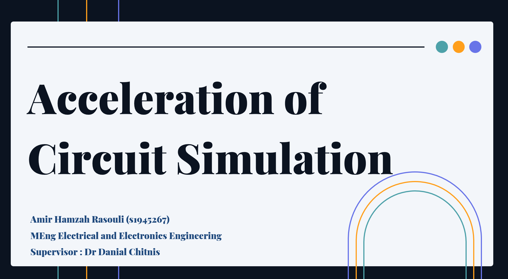
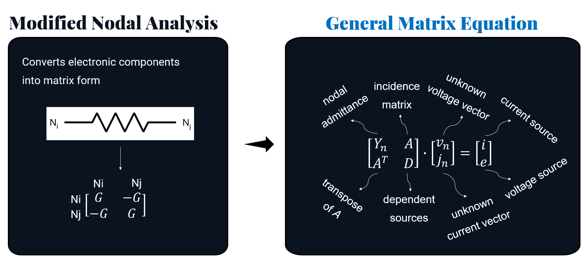
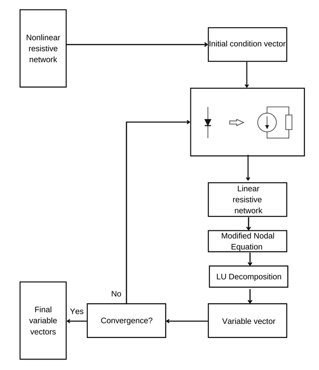
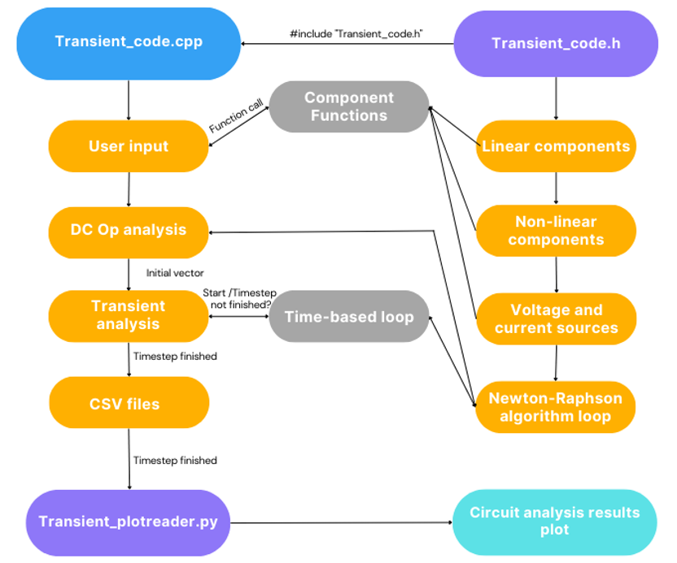

# Basic Overview
An MEng project which creates an optimizable circuit simulator mainly in C++ but also tested in Python and MATLAB. The purpose is to test how far softwares and hardware could go along together in achieving the best performance benchmarks. The main method in simulating these circuits is by using LU decomposition for the sparse matrices from the circuit variables. This is by converting the circuit nodes into matrices using the Modified Nodal Analysis methodology,



and solving them using Newton-Raphson algorithm and LU decomposition. 



As the circuit gets bigger, the sparsity of the matrices increases which needs more speed and technique for efficiency. This project sets up a circuit simulator fine-tuned for performance through the utilization of optimization flags on the CPU. Most of the research work has been written down in the [Daybook Loggings](Daybook-loggings.md) markdown file.

# Code Flowchart

Here is the high-level diagram of how the overall circuit code flowchart:



# Installation

The basic installation of the overall github code by copying the code using the git command line

> git clone https://github.com/AmirHamzahR/Acceleration-of-Circuit-Simulation.git

# Circuit Components and Analysis Instructions

The main cpp file is named as `Transient_code.cpp` and is located in the `\main\Transient_code.cpp` path. To assign the circuit components, it follows a similar assignment for any SPICE simulators.  The circuit component functions are called from the header file `Transient_code.h` and assigned inside the `main` and `DynamicNonlinear` function in `Transient_code.cpp`.

### _Resistor Assignment_
Resistor R, node x, node_y, value
```cpp
R_assigner(node_x, node_y, resistance_value, LHS, RHS);
```

### _Capacitor Assignment_
Capacitor C, node x, node y, capacitance value, timestep
```cpp
C_assigner(node_x, node_y, capacitance_value, timestep, LHS, RHS, solution, mode);
```

### _Diode Assignment_
Diode D, node x, node y, Is, VT, cd, timestep
```cpp
Diode_assigner(node_x, node_y, Is, VT, cd, timestep, LHS, RHS, solution, mode);
```

### _Current Source Assignment_
Current Source Is, node x, node y, current value
```cpp
Is_assigner(node_x, node_y, current_value, LHS, RHS);
```

### _Voltage Source Assignment_
Voltage Source Vs, node x, node y, voltage value
```cpp
Vs_assigner(node_x, node_y, voltage_value, LHS, RHS);
```

### _Voltage-Controlled Current Source (VCCS) Assignment_
VCCS, node x, node y, node cx, node cy, transconductance value
```cpp
VCCS_assigner(node_x, node_y, node_cx, node_cy, transconductance, LHS);
```

### _Pulsed Voltage Source Assignment_
Pulsed Voltage Source V, V1, V2, t1, td, tr, tf, tpw, tper, timestep
```cpp
V_pulse(V1, V2, t1, td, tr, tf, tpw, tper, timestep);
```

### _N-MOS Transistor Assignment_
N-MOS Transistor, number, node vd, node vg, node vs, node vb, timestep
```cpp
NMOS_assigner(number, node_vd, node_vg, node_vs, node_vb, timestep, solution, LHS, RHS, mode);
```

### _P-MOS Transistor Assignment_
P-MOS Transistor, number, node vs, node vg, node vd, node vb, timestep
```cpp
PMOS_assigner(number, node_vs, node_vg, node_vd, node_vb, timestep, solution, LHS, RHS, mode);
```

### _Ring Oscillator Assignment_
Ring Oscillator, W, L, R, C, timestep
```cpp
RingOscillatorStages(W, L, R, C, LHS, RHS, solution, timestep, mode);
```

## Transient Simulation Instructions

1. Define `t_start`, `t_end`, and `h` for transient simulation.
2. Configure the number of external nodes, MOSFETs, and cascaded levels.
3. Include "Transient_code.h" to define the main simulation function and matrices.

### Dynamic and Non-Linear Component Assignment
Define stamp matrices for dynamic and non-linear components using `DynamicNonLinear` function.

### Main Circuit Simulation Loop
1. Define matrix size using `Maxi` and `Maxj`.
2. Assign linear components' stamps to `LHS` and `RHS`.
3. Define initial conditions.
4. Perform OP analysis to initialize circuit state.
5. Include transient simulation loop to:
   - Update `LHS` and `RHS`.
   - Call Newton-Raphson system.
   - Store simulation results.

### Save Simulation Results
- `solution.csv`: Nodal voltages and currents.
- `MaxI.csv`: Maximum current values.
- `time.csv`: Time values.

### Execution and Benchmarking
- Code supports DC OP Analysis and Transient Analysis.
- Displays execution times for both analyses.

Adjust component values, nodes, time settings, and assignments as needed.
```
This Markdown document includes instructions for all the circuit components and types of analysis as requested.
```

